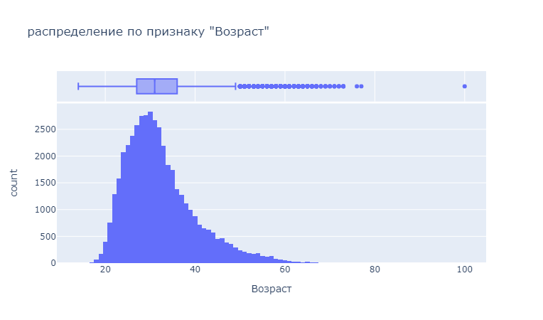
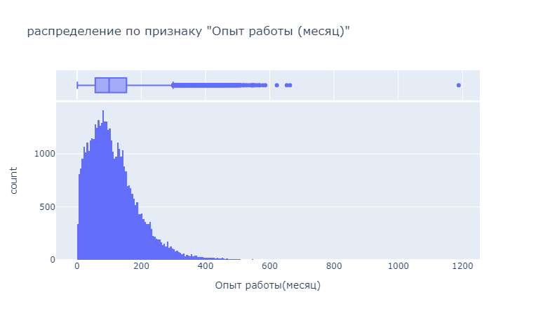
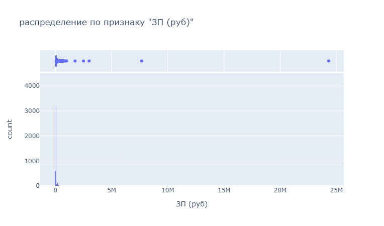
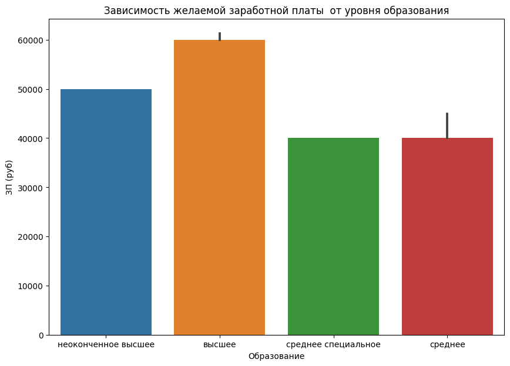
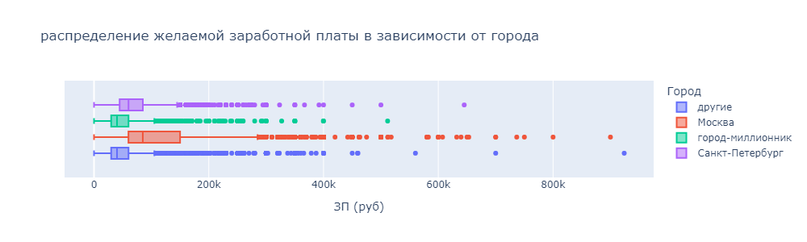
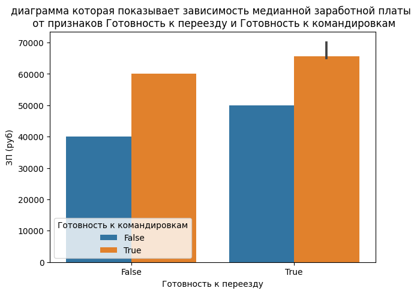
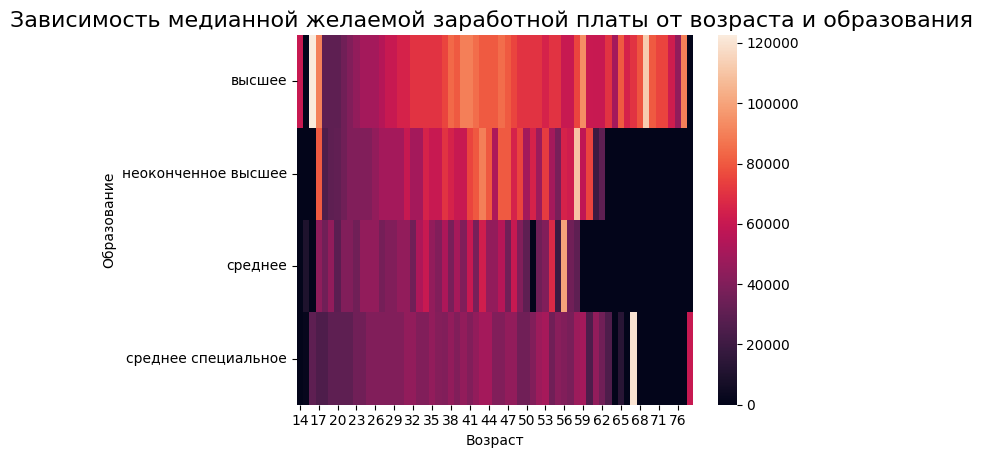
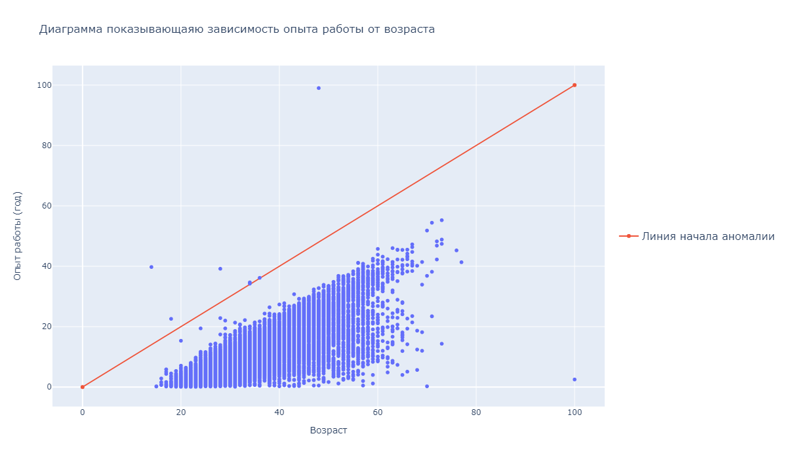
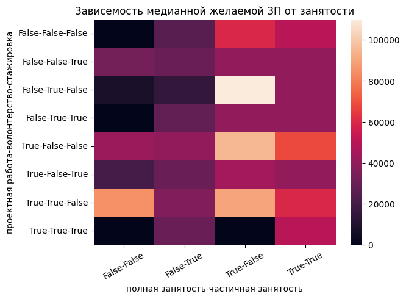
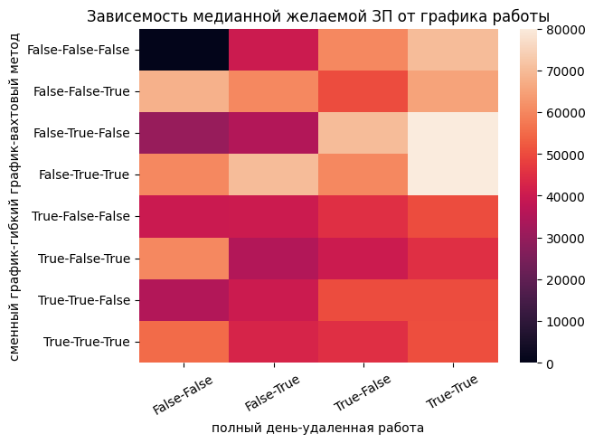

<center> 

# <center> Проект 1: Анализ резюме из HeadHunter

#### Python 3.9.13
# Огловление

[1. Описание проекта](https://github.com/alexey273-27/sf_data_sciense/blob/master/PROJECT-1.%20%D0%90%D0%BD%D0%B0%D0%BB%D0%B8%D0%B7%20%D1%80%D0%B5%D0%B7%D1%8E%D0%BC%D0%B5%20%D0%B8%D0%B7%20HeadHunter/README.md#Описание-проекта)
## Описание проекта
Нам необходимо иследовать структуру данных, затем преобразовать данные, иследовать зависемости в данных и в итоге очистить данные от пустых значений, выбросов дубликатов

[1.1 Исследование структуры данных](https://github.com/alexey273-27/sf_data_sciense/blob/master/PROJECT-1.%20%D0%90%D0%BD%D0%B0%D0%BB%D0%B8%D0%B7%20%D1%80%D0%B5%D0%B7%D1%8E%D0%BC%D0%B5%20%D0%B8%D0%B7%20HeadHunter/README.md#Исследование-структуры-данных)

[1.2 Преобразование данных](https://github.com/alexey273-27/sf_data_sciense/blob/master/PROJECT-1.%20%D0%90%D0%BD%D0%B0%D0%BB%D0%B8%D0%B7%20%D1%80%D0%B5%D0%B7%D1%8E%D0%BC%D0%B5%20%D0%B8%D0%B7%20HeadHunter/README.md#Преобразование-данных)

[1.3 Исследование зависимостей в данных](https://github.com/alexey273-27/sf_data_sciense/blob/master/PROJECT-1.%20%D0%90%D0%BD%D0%B0%D0%BB%D0%B8%D0%B7%20%D1%80%D0%B5%D0%B7%D1%8E%D0%BC%D0%B5%20%D0%B8%D0%B7%20HeadHunter/README.md#Исследование-зависимостей-в-данных)

[1.4 Очистка данных](https://github.com/alexey273-27/sf_data_sciense/blob/master/PROJECT-1.%20%D0%90%D0%BD%D0%B0%D0%BB%D0%B8%D0%B7%20%D1%80%D0%B5%D0%B7%D1%8E%D0%BC%D0%B5%20%D0%B8%D0%B7%20HeadHunter/README.md#Очистка-данных)


###  Исследование структуры данных
## Использованные инструменты и библиотеки

* pandas 2.0.2
* numpy 1.24.3
* matplotlib  3.7.1
* seaborn 0.12.2
* plotly.express 5.15.0


Прочитаем данные с помощью библиотеки Pandas   
Выведим несколько первых (последних) строк таблицы чтобы убедиться в том, что ваши данные не повреждены  
Выведем основную информацию о числе непустых значений в столбцах и их типах в таблице.
Видно что таблица **hh_database** имеет 44744 строки и  12 столбцов типа   
**dtypes: object(12)** и занимает в памяти memory usage: **4.1+ MB**   
Так же из таблицы видно что в трех столбцах есть пропуски    
Опыт работы                        44576  
Последнее/нынешнее место работы    44743  
Последняя/нынешняя должность       44742

Расматривая основную статистическую информацию о столбцах.
из таблицы видно что очень много уникальных значений которые можно разделить и преобразовать 

:arrow_up:[к оглавлению](https://github.com/alexey273-27/sf_data_sciense/blob/master/PROJECT-1.%20%D0%90%D0%BD%D0%B0%D0%BB%D0%B8%D0%B7%20%D1%80%D0%B5%D0%B7%D1%8E%D0%BC%D0%B5%20%D0%B8%D0%B7%20HeadHunter/README.md#Огловление)
### Преобразование данных
Создадим с помощью функции-преобразования новый признак **"Образование"**, который должен иметь 4 категории: **"высшее"**, **"неоконченное высшее"**, **"среднее специальное"** и **"среднее"**. Для этого напишем функцию level_education и подставим в метод ***apply***
Удалим признак **"Образование и ВУЗ"**.

Преобразуем столбец **Пол и Возраст** в два новых столбца **"Пол"** и **"Возраст"** где Пол будет "М" или "Ж" , а возраст в целых числах годов используем метод ***apply*** для этого.
также удалим столбец **Пол и Возраст**

Преобразуем  столбец **"Опыт работы"** в **"Опыт работы (месяц)"** по средствам функции **trans_month** которая переводит количество годов и месяцов в месяца и удалим столбец **"Опыт работы"**

Преобразуем  столбец **"Город, переезд, командировки"** в три столбца **"Город"**, **"Готовность к переезду"**, **"Готовность к командировкам"** в столбце **"Город"** должен содержать только 4 категории: ***"Москва"***, ***"Санкт-Петербург"***, ***"город-миллионник"*** (их список ниже), остальные обозначаются как ***"другие"***. Cтолбцы **"Готовность к переезду"**, **"Готовность к командировкам"** имеют значение ***'True', 'False'***  
список городов миллионников:**['Новосибирск', 'Екатеринбург','Нижний Новгород','Казань', 'Челябинск','Омск', 'Самара', 'Ростов-на-Дону', 'Уфа', 'Красноярск', 'Пермь', 'Воронеж','Волгоград']**  
Напишем функцию **sity_r** которая будет сортировать из какого города соискатель и методом apply создадим столбец **"Город"** также создадим столбцы **"Готовность к переезду"**, **"Готовность к командировкам"** методом ***apply***

Рассмотрим признаки **"Занятость"** и **"График"** они предстовляют собой набор категорий желаемой занятости (**полная занятость**, **частичная занятость**, **проектная работа**, **волонтерство**, **стажировка**) и желаемого графика работы (**полный день**, **сменный график**, **гибкий график**, **удаленная работа**, **вахтовый метод**). Cоискатель может указывать различные комбинации данных категорий, по этому создадим признаки-мигалки для каждой категории: если категория присутствует в списке желаемых соискателем, то в столбце на месте строки рассматриваемого соискателя ставится ***True***, иначе - ***False***.
Для этого найдем вхождение каждой котегории в признаках.

В признаке желаемой зароботной платы (**ЗП**) соискатели вырожали свои желания **ЗП** в разных валютах поэтому приведем **ЗП** к одной (***руб***)и назовем ее **ЗП (руб)** по этому для начала напишем функцию которая приводит неаименование валют к стандартному виду в **ISO** кодировке. За дату обменного курса возмем дату составления резюме которую приведем к виду **ГГГГ-ММ-ДД**. Скачаем  таблицу ExchangeRates.csv в которой находятся выгрузка курсов валют, которые встречаются в наших данных за период с 29.12.2017 по 05.12.2019.   
Нам потребуются столбцы:
* "currency" - наименование валюты в ISO кодировке,
* "date" - дата, 
* "proportion" - пропорция, 
* "close" - цена закрытия (последний зафиксированный курс валюты на указанный день).
остальные удалим а столбец "date" переведем к виду **ГГГГ-ММ-ДД**
Обьеденим нашу таблицу с таблицей курсов, вычеслим ЗП в рублях по формуле : Умножить сумму желаемой заработной платы на присоединенный курс валюты (close) и разделить на пропорцию, результат занести в новый столбец **"ЗП (руб)"**   
Удалим из нашей таблице лишние столбцы **'ЗП', 'сумма', 'валюта','currency','proportion', 'close', 'date'**


:arrow_up:[к оглавлению](https://github.com/alexey273-27/sf_data_sciense/blob/master/PROJECT-1.%20%D0%90%D0%BD%D0%B0%D0%BB%D0%B8%D0%B7%20%D1%80%D0%B5%D0%B7%D1%8E%D0%BC%D0%B5%20%D0%B8%D0%B7%20HeadHunter/README.md#Огловление)
### Исследование зависимостей в данных

Построим распределение признака **"Возраст"**

Из графиков видно:
1. мода признака Возраст = 30 годам
2. 50 % соискателей это люди возрастом от 27 до 36 лет, остальные распределились от 14 лет до 27 и от 36 до 49 по 25 %  соответственно 
3. минимальное значение возраста 14 лет максимальное значение 100 лет
4. соискателей свыше 49 лет не много и это потонциальные выбросы. 
5. Самый большой возраст это 100 лет что скорее всего это выброс, да и люди возрастом выше 65 уже пенсионеры.

Построим распределение признака **"Опыт работы (месяц)"**

Из графиков видно :
1. Мода опыта работы равна 81 месяц 
2. Опыт работы у соискателей начинается от одного месяца и заканчивается 1188 месяцев
3. У большенства соискателей опыт работы находится в интервале от 1 до 299 месяцев
4. Выроженной анамалией явлдяется опыт работы 1188 месяцев (99)лет хотя возраст его 48 лет что не может быть

Построим распределение признака **"ЗП (руб)"**

Из графика видно:
1. Мода признака ЗП(руб) равна 50 тыс руб
2. Минимальная значение ЗП равна 1 рубль а максимальное значение 24304876 руб
3. У большенства соискателей желаемая ЗП находится в интервале от 1 рубля до 181 тысячи руб
4. ЗП свыше 1 милиона руб скарей всего являются анамалиями

Построим диаграмму, которая показывает зависимость **медианной** желаемой заработной платы (**"ЗП (руб)"**) от уровня образования (**"Образование"**).

Из графика видно:
1. Наибольший уровнь желаемой заработной платы у соискателей с вышим образованием
2. Наименьший уровнь желаемой заработной платы у соискателей со средним и средне специальным образованием
3. Признак уровня образования важен так как соискатели с разным уровнем образования имеют разные уровни желаемой ЗП

Построим диаграмму, которая показывает распределение желаемой заработной платы (**"ЗП (руб)"**) в зависимости от города (**"Город"**).

Из графиков видно:
1. В Москве желаемая З.П. выше и ноходится от 60 до 150 тыс руб а медианная З.П. 85 тыс руб
2. Минимальные требования желаемой З.П. в городах миллионниках и других городах от 30 до 60 тыс руб медианная З.П. 40 тыс руб
3. Признак города важен в прогназировании З.П.

Построим **многоуровневую столбчатую диаграмму**, которая показывает зависимость медианной заработной платы (**"ЗП (руб)"**) от признаков **"Готовность к переезду"** и **"Готовность к командировкам"**.

Из графика видно:
1. медианная желаемая заработная плата выше у готовых к переезду и к командировкам 
2. медианная желаемая заработная плата выше у готовых к командировкам но не готовых переезжать к готовым переехать но неготовых к командировкам

Построим сводную таблицу, иллюстрирующую зависимость **медианной** желаемой заработной платы от возраста (**"Возраст"**) и образования (**"Образование"**). На полученной сводной таблице построим **тепловую карту**.

Из графика видно:
1. максимальная медианная желаемая заработная плата у людей от 35 до 47 лет с высшем образованнием свыше 100 000 руб
2. у людей с неоконченым высшем образованием медианная желаемая  заработная плата в раёне от 60 000 до 100 000 руб
3. у людей со средним и средне специальным образованием медианная  желаемая заработная плата до 60 000 руб
4. у людей возростом от 35 до 50 лет повышеные требования к зароботной плате 

Построим **диаграмму рассеяния**, показывающую зависимость опыта работы (**"Опыт работы (месяц)"**) от возраста (**"Возраст"**).

Из граика видно:  
1. Несколько (7) человек указало что их опыт работы больше их возраста
2. Средне различие опыта работы и возраста от 16 лет и и больше
3. Соискатели начинаются возрастом от 15 лет

Построим сводную таблицу, иллюстрирующую зависимость **медианной** желаемой заработной платы от занятости . На полученной сводной таблице построим **тепловую карту**.

Из графика видно:
1. Что медианная желалаемая ЗП в работающих полный рабочий день  выше 
2. Что медианная желалаемая ЗП в работающих полный рабочий день или частично также высока нежели просто частичная занятость
3. Что медианная желалаемая ЗП в работающих над проектами и волонтерством тоже высока 
4. Средняя медианная желалаемая ЗП находится в пределах 50 тыс руб 

Построим сводную таблицу, иллюстрирующую зависимость **медианной** желаемой заработной платы от графика работы . На полученной сводной таблице построим **тепловую карту**.

Из  графика видно:
1. Полный день, удаленная работа, гибкий график и вахтовый метод является самыми высокими требованиями к ЗП более 80 тыс руб 
2. У людей со сменный графиком работы требования к ЗП ниже 
:arrow_up:[к оглавлению](https://github.com/alexey273-27/sf_data_sciense/blob/master/PROJECT-1.%20%D0%90%D0%BD%D0%B0%D0%BB%D0%B8%D0%B7%20%D1%80%D0%B5%D0%B7%D1%8E%D0%BC%D0%B5%20%D0%B8%D0%B7%20HeadHunter/README.md#Огловление)
### Очистка данных

:arrow_up:[к оглавлению](https://github.com/alexey273-27/sf_data_sciense/blob/master/PROJECT-1.%20%D0%90%D0%BD%D0%B0%D0%BB%D0%B8%D0%B7%20%D1%80%D0%B5%D0%B7%D1%8E%D0%BC%D0%B5%20%D0%B8%D0%B7%20HeadHunter/README.md#Огловление)

### Алгоритм метода:

1. Вычислить 25-ую и 75-ую квантили (1 и 3 квартили) - $Q_{25}$ и $Q_{75}$ для признака, который мы исследуем
2. Вычислить межквартильное расстояние:  
    * $IQR=Q_{75}-Q_{25}$
3. Определить верхнюю и нижнюю границы Тьюки: 

    * $bound_{upper} = Q_{75} + 1.5*IQR$
    
    * $bound_{lower} = Q_{25} - 1.5*IQR$
4. Найти наблюдения, которые выходят за пределы границ


### **Недостатки метода:**

Метод требует, чтобы признак, на основе которого происходит поиск выбросов, был распределен нормально.

### **Модификация метода:**

Можно попробовать воспользоваться методами преобразования данных, например, логарифмированием, чтобы попытаться свести распределение к нормальному или хотя бы к симметричному. 

Также можно добавить вариативности количеству квартильных размахов в левую и правую сторону распределений.


## Метод z-отклонений (метод сигм)

Правило трех сигм гласит: что, если распределение данных является нормальным, то 99.73% лежат в интервале: $(\mu-3 \sigma$ , $\mu+3 \sigma)$, 
где  
* $\mu$ - математическое ожидание (для выборки это среднее значение)
* $\sigma$ - стандартное отклонение. 

Наблюдения, которые лежат за пределами этого интервала будут считаться выбросами.


### **Алгоритм метода:**

1. Вычислить среднее и стандартное отклонение $\mu$ и $\sigma$ для признака, который мы исследуем
2. Определить верхнюю и нижнюю границы:
    * $bound_{upper} = \mu - 3 * \sigma$
    
    * $bound_{lower} = \mu + 3 * \sigma$
3. Найти наблюдения, которые выходят за пределы границ

### **Недостатки метода:**
Метод требует, чтобы признак, на основе которого происходит поиск выбросов, был распределен нормально.

### **Модификация метода:**

Можно попробовать воспользоваться методами преобразования данных, например, логарифмированием, чтобы попытаться свести распределение к нормальному или хотя бы к симметричному. 

Также можно добавить вариативности количеству стандартных отклонений в левую и правую сторону распределений.

## Реализация методов

Методы реализованы в виде функций find_outliers_iqr() и find_outliers_z_score(). Функции представлены в файле find_outliers.py. К функциям предоставлена документация.

## Пример использования

Обязательными аргументами функций, реализующих методы поиска выбросов являются:
* data (pandas.DataFrame): набор данных (таблица)
* feature (str): имя признака, на основе которого происходит поиск выбросов

Использование классических подходов без модификаций:
```python
# Метод межквартильного размаха
from outliers_lib.find_outliers import find_outliers_iqr

outliers_iqr, cleaned_iqr = find_outliers_iqr(data, feature)

# Метод z-отклонений
from outliers_lib.find_outliers import find_outliers_z_score

find_outliers_z_score
outliers_z_score, cleaned_z_score = find_outliers_z_score(data, feature)
```
Использование методов с предварительным логарифмированием:
```python
outliers_iqr, cleaned_iqr = find_outliers_iqr(data, feature, log=True)
outliers_z_score, cleaned_z_score = find_outliers_z_score(data, feature, log=True)
```
Использование методов с предварительным логарифмированием и добавлением вариативности разброса:
```python
outliers_iqr, cleaned_iqr = find_outliers_iqr(data, feature, log=True, left=2, right=2)
outliers_z_score, cleaned_z_score = find_outliers_z_score(data, feature, log=True, left=2, right=2)
```


## Использованные инструменты и библиотеки
* numpy (1.20.3)
* pandas (1.3.4)

## Дополнительные источники:
* [Нормальное распределение](https://ru.wikipedia.org/wiki/Нормальное_распределение)
* [Метод межквартильного размаха](https://recture.ru/common/chto-takoe-pravilo-mezhkvartilnogo-razmaha/)
* [Правило трех сигм](https://wiki.loginom.ru/articles/3-sigma-rule.html)


